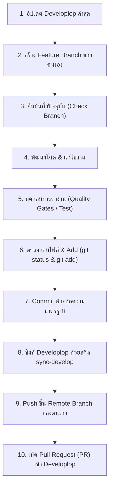

# มาตรฐานการทำงานและการใช้ Git สำหรับทีมและ AI Agent (agent.md)

เอกสารนี้กำหนด **มาตรฐานลำดับขั้นตอนการทำงาน (Workflow)** ของทีมพัฒนาทุกคนและ AI Agent เพื่อให้การทำงานในโปรเจกต์ **Scholarship Tracking System** เป็นไปในทิศทางเดียวกัน ป้องกันการทำงานผิดกิ่ง โค้ดทับซ้อน (Conflict) หรือโค้ดบนกิ่งกลางเสียหาย

---

## 📌 สรุปกฎเหล็ก 6 ข้อ (Golden Rules)

1. **ห้ามทำงานหรือ commit บนกิ่ง `Developlop` หรือ `main` โดยตรงเด็ดขาด** (ต้องทำบน Feature Branch ของตัวเองเสมอ)
2. **เริ่มต้นกิ่งใหม่จาก `origin/Developlop` ที่อัปเดตล่าสุดเสมอ**
3. **ตรวจสอบกิ่งปัจจุบัน (`git branch --show-current`) ก่อนเริ่มเขียนโค้ดทุกครั้ง**
4. **ทดสอบระบบ (`npm run dev` / `npm run build` / tests) ให้ผ่านก่อน push เสมอ**
5. **ทุกคนและ AI Agent ต้องใช้สกิล `sync-develop` ในการซิงค์โค้ดจาก `Developlop`** ก่อนเริ่มงานรอบใหม่และก่อน push ทุกครั้ง
6. **การรวมโค้ดเข้าสู่ `Developlop` ต้องทำผ่าน Pull Request (PR) เท่านั้น**

---

## 🔄 ลำดับขั้นตอนการทำงานมาตรฐาน (Step-by-Step Workflow)



---

### ขั้นตอนที่ 1: อัปเดต Developlop ให้เป็นปัจจุบัน

ก่อนเริ่มต้นทำงานใหม่ทุกครั้ง ให้ดึงโค้ดล่าสุดจากกิ่งกลาง (`origin/Developlop`):

```powershell
# 1.1 สลับไปยังกิ่ง Developlop ในเครื่อง
git checkout Developlop

# 1.2 ดึงโค้ดล่าสุดจาก GitHub
git fetch origin Developlop
git pull origin Developlop
```

---

### ขั้นตอนที่ 2: สร้างกิ่ง Feature ของตนเอง

สร้างกิ่งใหม่โดยแตกออกมาจาก `Developlop` เสมอ โดยตั้งชื่อตามมาตรฐานโมดูลและงานที่ได้รับมอบหมาย:

#### 🏷️ กฎการตั้งชื่อ Branch:
รูปแบบ: `feat/<module-id>-<short-description>` หรือ `<module-code>/<feature-name>`

- **M01 — User & Student Management**: `feat/m01-user-student` หรือ `fa/user-management`
- **M02 — Scholarship Management**: `feat/m02-scholarship-mgmt` หรือ `fa/scholarship`
- **M03 — Application & Document Management**: `feat/m03-application-doc` หรือ `fa/Application-&-Document`
- **M04 — Scholarship Review & Evaluation**: `feat/m04-review-evaluation` หรือ `fa/review-eval`
- **M05 — Award & Follow-up Management**: `feat/m05-award-followup` หรือ `fa/award-followup`
- **M06 — Dashboard, Report & Notification**: `feat/m06-dashboard-report` หรือ `fa/dashboard-report`

```powershell
# ตัวอย่าง: สร้างและสลับไปยังกิ่งใหม่
git checkout -b feat/m03-application-doc Developlop
```

---

### ขั้นตอนที่ 3: ยืนยันกิ่งของตัวเอง (Verify Current Branch)

> [!IMPORTANT]
> **ต้องตรวจสอบก่อนเริ่มเขียนโค้ดเสมอ** เพื่อป้องกันการเผลอเขียนทับบน `Developlop` หรือกิ่งของเพื่อน

```powershell
# ตรวจสอบชื่อกิ่งปัจจุบัน
git branch --show-current

# ตรวจสอบสถานะ working tree (ต้องสะอาด ไม่มีไฟล์ค้าง)
git status
```
- ผลลัพธ์ต้องแสดงชื่อกิ่งของคุณ (ไม่ใช่ `Developlop` หรือ `main`)
- หากยังอยู่ผิดกิ่ง ให้สลับกิ่งทันทีก่อนลงมือแก้ไขโค้ด

---

### ขั้นตอนที่ 4: พัฒนาโค้ดและทดสอบระบบ (Dev & Test)

พัฒนาฟีเจอร์ตามขอบเขตของโมดูลที่รับผิดชอบ โดยคำนึงถึง:
- ไม่แก้ไขไฟล์ของโมดูลอื่นโดยไม่ตกลงกันล่วงหน้า
- ห้าม commit ไฟล์ความลับ เช่น `.env.local` หรือ Service Key

#### 🧪 การทดสอบก่อนบันทึกงาน:
ก่อนทำการ commit ต้องทดสอบอย่างน้อย:
```powershell
# ตรวจสอบว่าโปรเจกต์คอมไพล์และรันได้ปกติ
npm run dev

# หากมีคำสั่ง build หรือ test ใน package.json ให้รันตรวจสอบ
npm run build
```

---

### ขั้นตอนที่ 5: ตรวจสอบและเลือกไฟล์เพื่อบันทึก (Git Add)

ตรวจสอบไฟล์ที่มีการเปลี่ยนแปลงก่อนเพิ่มเข้า staging area เสมอ:

```powershell
# 5.1 ดูรายการไฟล์ที่มีการเปลี่ยนแปลง
git status -s

# 5.2 ตรวจดูความถูกต้องของโค้ดที่แก้ไข
git diff

# 5.3 เพิ่มเฉพาะไฟล์ที่เกี่ยวข้องกับงานรอบนี้ (หลีกเลี่ยง git add . หากมีไฟล์ไม่เกี่ยวข้อง)
git add src/modules/m03/
git add package.json
```

---

### ขั้นตอนที่ 6: บันทึกประวัติการแก้ไข (Git Commit)

เขียนข้อความ Commit ให้สื่อความหมาย ชัดเจน ตามหลักสากล (Conventional Commits):

#### 📝 รูปแบบ:
`<type>: <คำอธิบายสั้น ๆ ว่าทำอะไร>`

- `feat:` เพิ่มฟังก์ชันการทำงานใหม่ (เช่น `feat: add student application form`)
- `fix:` แก้ไขบักหรือข้อผิดพลาด (เช่น `fix: resolve document upload validation error`)
- `docs:` แก้ไขเอกสาร (เช่น `docs: update API specification for M03`)
- `style:` ปรับแต่ง UI / CSS (เช่น `style: update button colors in application layout`)
- `refactor:` ปรับโครงสร้างโค้ดโดยไม่เปลี่ยนพฤติกรรม
- `chore:` งานจัดการทั่วไป ติดตั้งแพ็กเกจ (เช่น `chore: install lucide-react`)

```powershell
# ตัวอย่างการ commit
git commit -m "feat: implement document upload component for M03"
```

---

### ขั้นตอนที่ 7: ซิงค์อัปเดตล่าสุดจาก Developlop ด้วยสกิล `sync-develop`

> [!IMPORTANT]
> **ข้อกำหนดบังคับ**: ทุกคนและ AI Agent ต้องซิงค์โค้ดจาก `Developlop` อย่างสม่ำเสมอ โดยเฉพาะ **ก่อนเริ่มทำงานในแต่ละวัน** และ **ก่อน push งานขึ้น GitHub**

โปรเจกต์นี้มีสกิลมาตรฐานเตรียมไว้ที่ [`.agents/skills/sync-develop/SKILL.md`](file:///.agents/skills/sync-develop/SKILL.md)

#### 🚀 วิธีใช้งานสำหรับผู้ใช้ AI Agent (Antigravity / Copilot / Claude):
เพียงสั่งคำสั่งสั้น ๆ ในแชท:
```text
"sync develop" หรือ "ซิงค์ develop" หรือ "อัปเดตจาก developlop"
```
AI Agent จะเรียกใช้สกิล `sync-develop` และดำเนินการตามขั้นตอนความปลอดภัย 6 ขั้นโดยอัตโนมัติ:
1. ตรวจสอบ `git status` และชื่อกิ่งปัจจุบัน (ห้ามทำบน main หรือ Developlop)
2. ทำการ `git fetch origin Developlop`
3. ตรวจสอบ commit diff ระหว่างกิ่งปัจจุบันกับ `origin/Developlop`
4. รัน `git merge origin/Developlop` อย่างปลอดภัย
5. รัน Quality Gates ตรวจสอบความถูกต้องของโปรเจกต์
6. สรุปผลลัพธ์และรอการยืนยันก่อน push

#### 🛠️ วิธีทำด้วยตนเองใน Terminal (หากไม่ได้ใช้ Agent):
```powershell
# 7.1 ตรวจสอบสถานะ working tree ให้สะอาดก่อน
git status -s

# 7.2 Fetch ข้อมูลล่าสุดจาก Developlop
git fetch origin Developlop

# 7.3 ตรวจสอบความแตกต่างก่อนรวมโค้ด
git log HEAD..origin/Developlop --oneline

# 7.4 Merge อัปเดตล่าสุดเข้าสู่กิ่งของตนเอง
git merge origin/Developlop
```

> [!WARNING]
> **หากเกิด Merge Conflict:**
> 1. หยุดและตรวจสอบไฟล์ที่เกิด conflict ด้วย `git status`
> 2. เปิดไฟล์ที่มี conflict และปรึกษากับเจ้าของโค้ดส่วนนั้น
> 3. **ห้ามลบโค้ดของเพื่อนทิ้งโดยพลการ**
> 4. เมื่อแก้ไข conflict เสร็จแล้ว ให้ทดสอบรัน (`npm run dev`) ใหม่อีกครั้ง แล้วจึง commit การแก้ไข

---

### ขั้นตอนที่ 8: ส่งโค้ดขึ้น GitHub (Git Push)

ผลักโค้ดขึ้นเฉพาะกิ่ง Feature ของตนเองเท่านั้น:

```powershell
# Push ครั้งแรกเพื่อตั้งค่า upstream (ใส่เครื่องหมายคำพูดหากชื่อกิ่งมี &)
git push -u origin "<your-branch-name>"

# Push ในครั้งถัดไป
git push
```

> [!CAUTION]
> **ข้อห้าม:** ห้ามใช้คำสั่ง `git push -f` (Force Push) บน shared branch เป็นอันขาด

---

### ขั้นตอนที่ 9: สร้าง Pull Request (PR) เข้าสู่ Developlop

1. ไปที่หน้า GitHub Repository: [TeepakornJongjit/The_Project](https://github.com/TeepakornJongjit/The_Project)
2. กด **Compare & pull request**
3. ตั้งค่า Base และ Compare:
   - **Base Branch**: `Developlop` (กิ่งกลางหลัก)
   - **Compare Branch**: `<your-feature-branch>`
4. กรอกชื่อ PR และรายละเอียด:
   - อธิบายสิ่งที่ทำใน PR นี้
   - ระบุ Module ที่เกี่ยวข้อง (เช่น `[M03] Application Form`)
   - ระบุสิ่งที่ได้รับการทดสอบแล้ว
5. มอบหมาย Reviewer ให้เพื่อนหรือหัวหน้าทีมตรวจทาน
6. เมื่อได้รับการอนุมัติ (Approved) จึงทำการ **Merge Pull Request**

---

## 🤖 ข้อปฏิบัติเฉพาะสำหรับ AI Agent

เมื่อ AI Agent (เช่น Antigravity / Claude / GitHub Copilot) ช่วยพัฒนาโค้ด ต้องปฏิบัติตามข้อกำหนดต่อไปนี้อย่างเคร่งครัด:

1. **ตรวจสอบ Branch เสมอ**: ก่อนดำเนินการแก้ไขโค้ดหรือรันคำสั่งใด ๆ ต้องรัน `git branch --show-current` หากพบว่าอยู่บน `Developlop` หรือ `main` ต้องหยุดและแจ้งเตือนผู้ใช้ทันที
2. **ใช้สกิล `sync-develop` เสมอ**: เมื่อได้รับคำสั่งให้ซิงค์โค้ดจาก `Developlop` ให้เรียกใช้และปฏิบัติตามขั้นตอนใน [`.agents/skills/sync-develop/SKILL.md`](file:///.agents/skills/sync-develop/SKILL.md) ทุกครั้ง
3. **ห้ามแก้ไขไฟล์นอกขอบเขต**: ดำเนินการเฉพาะไฟล์ใน Module ที่ได้รับมอบหมาย ไม่แตะต้อง config ส่วนกลางหรือไฟล์ของ Module อื่นโดยไม่ได้รับคำสั่งชัดเจน
4. **รักษาความสะอาดของไฟล์ความลับ**: ไม่สร้าง ไม่แก้ไข และไม่ commit ไฟล์ `.env`, `.env.local` หรือ credential ต่าง ๆ
5. **ทดสอบหลังแก้ไข (Verify)**: หลังเขียนโค้ดเสร็จ ต้องรันการตรวจสอบว่าโค้ดคอมไพล์ผ่าน ไม่พัง build และไม่สร้าง runtime error
6. **รายงานผลอย่างโปร่งใส**: รายงานสถานะ Git (Branch, Commits, Changes) ให้ผู้ใช้ทราบอย่างชัดเจนทุกครั้งหลังดำเนินการ

---

## 📋 Checklist สรุปก่อนปิดงานในแต่ละวัน

- [ ] อยู่บน Feature Branch ของตัวเอง (ไม่ใช่ `Developlop` หรือ `main`)
- [ ] โค้ดคอมไพล์ผ่าน รัน `npm run dev` ได้ ไม่มี error
- [ ] ไม่มีไฟล์ `.env.local` หรือไฟล์ชั่วคราวค้างใน `git status`
- [ ] ทำการ commit ด้วยข้อความที่สื่อความหมาย
- [ ] **ซิงค์โค้ดล่าสุดจาก `origin/Developlop` ด้วยสกิล `sync-develop` หรือคำสั่งมาตรฐานแล้ว**
- [ ] Push ขึ้น remote branch ของตนเองเรียบร้อย
- [ ] เปิด Pull Request เข้าสู่ `Developlop` (หากฟีเจอร์เสร็จสมบูรณ์)
