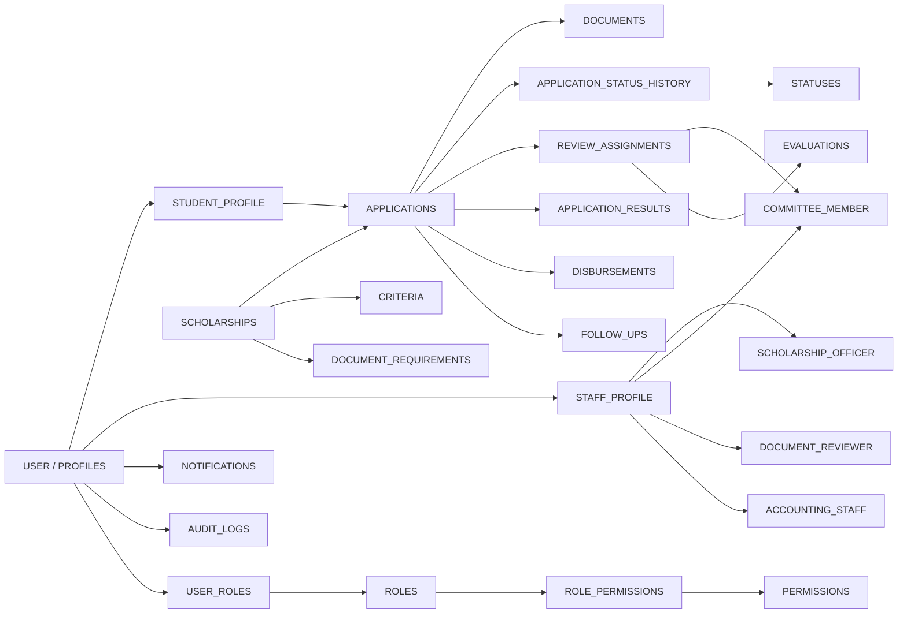

# Updated ER Diagram — ระบบติดตามทุนการศึกษา

> ER นี้เป็นแบบ Logical/Implementation-oriented ที่ใช้เป็นฐานเดียวกับ Supabase schema ปัจจุบัน

## 1. Core Relationship Model

```text
USER/PROFILE
 ├── STUDENT_PROFILE
 │      └── APPLICATION
 │            ├── DOCUMENT
 │            ├── APPLICATION_STATUS_HISTORY ── STATUS
 │            ├── REVIEW_ASSIGNMENT ── COMMITTEE_MEMBER
 │            │       └── EVALUATION
 │            ├── APPLICATION_RESULT
 │            ├── DISBURSEMENT
 │            └── FOLLOW_UP
 │
 └── STAFF_PROFILE
        ├── SCHOLARSHIP_OFFICER
        ├── COMMITTEE_MEMBER
        ├── DOCUMENT_REVIEWER
        └── ACCOUNTING_STAFF

SCHOLARSHIP
 ├── CRITERIA
 └── DOCUMENT_REQUIREMENTS

USER
 ├── NOTIFICATIONS
 └── AUDIT_LOGS

USER ── USER_ROLE ── ROLE ── ROLE_PERMISSION ── PERMISSION
```

## 2. Mermaid/Lucid Version



## 3. Cardinality Rules

- `STUDENT_PROFILE 1 : M APPLICATION`
- `SCHOLARSHIP 1 : M APPLICATION`
- `SCHOLARSHIP 1 : M CRITERIA`
- `SCHOLARSHIP 1 : M DOCUMENT_REQUIREMENTS`
- `APPLICATION 1 : M DOCUMENT`
- `APPLICATION 1 : M APPLICATION_STATUS_HISTORY`
- `STATUS 1 : M APPLICATION_STATUS_HISTORY`
- `APPLICATION 1 : M REVIEW_ASSIGNMENT`
- `REVIEW_ASSIGNMENT 1 : 0..1 EVALUATION`
- `APPLICATION 1 : 0..1 APPLICATION_RESULT`
- `APPLICATION 1 : 0..1 DISBURSEMENT`
- `APPLICATION 1 : M FOLLOW_UP`
- `USER 1 : M NOTIFICATIONS`
- `USER 1 : M AUDIT_LOGS`

## 4. Implementation Notes

- `profiles.id` represents the conceptual USER and references `auth.users(id)`.
- `document_requirements` defines what a scholarship requires; `documents` stores what a student actually uploads.
- `application_status_history` preserves status changes instead of overwriting the history.
- `review_assignments` separates assignment from the actual committee evaluation.
- `application_results` stores the final decision separately from workflow status.
- `disbursements` represents payment after an application receives an approved result.
- `follow_ups` supports the M05 post-award tracking requirement.
- `notifications` belongs to `profiles` so staff and students can receive notifications.
- `audit_logs` is intentionally separate from business data for traceability.
